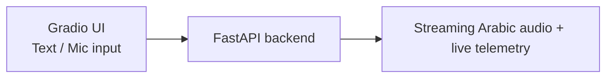
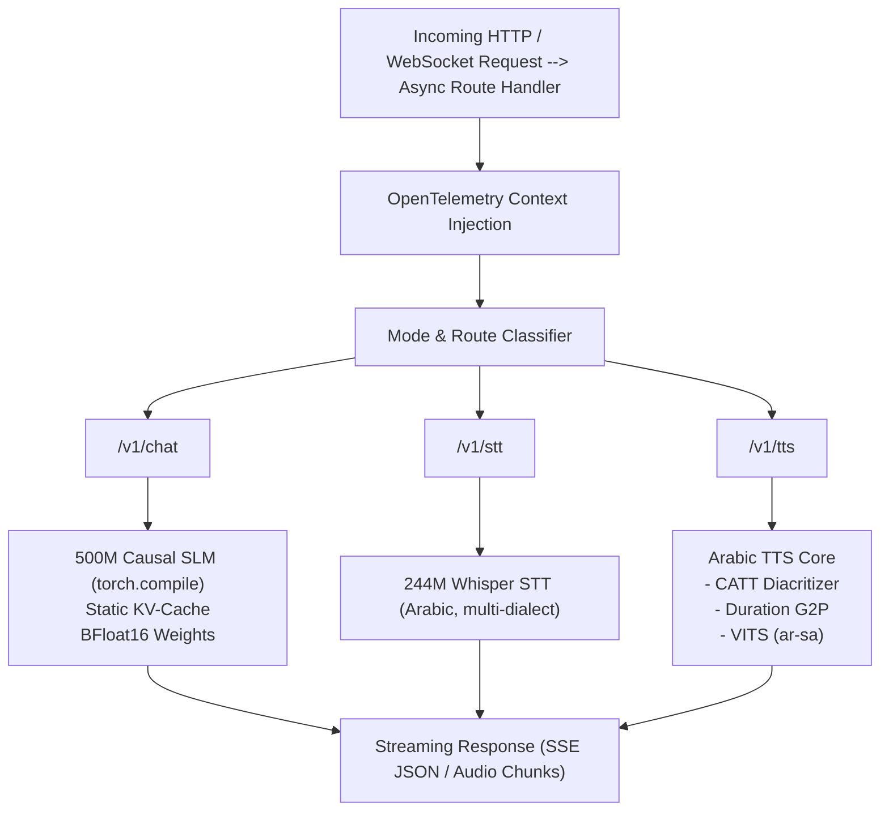

# `bayan-slm-engine`

A specialized **~500M parameter Arabic Small Language Model (SLM)** paired with a decoupled micro-acoustic engine (244M Whisper-Small Arabic STT + Saudi-Native VITS TTS). Built for a single NVIDIA RTX 3070 (8 GB VRAM) under WSL2.

## Interactive Demo



`make serve-ui` launches the Gradio **engineering inspection dashboard** — 3-stage pipeline: **Raw Text → CATT Diacritization → VITS Audio** with live hardware telemetry. Full recording protocol: `docs/BLUEPRINT.md` §4.

## Architecture

The serving tier bridges the custom PyTorch models to standard web protocols via an asynchronous **FastAPI** server (no `vLLM`/`TGI`). Native inference gives absolute control over KV-cache allocation, memory fragmentation, and tensor tracing.



**Data flow:** Raw Arabic audio → Whisper STT (244M) → Falcon-H1 SLM (~500M) → CATT diacritizer → VITS TTS (`ar-sa`).

## Hardware Constraints

| Resource | Limit |
| --- | --- |
| GPU | NVIDIA RTX 3070 — **8 GB VRAM** (OS/display on integrated GPU) |
| Host RAM | 16 GB total, hard-capped at **12 GB** for WSL2 Ubuntu |
| Pretraining VRAM budget | ≤ 4.2 GB (8-bit AdamW + gradient checkpointing + SDPA) |
| DPO alignment VRAM budget | ≤ 4.8 GB (frozen reference + active policy + 8-bit optimizer) |
| Serving VRAM budget | ≤ 2.89 GB (SLM + KV-cache + STT + TTS sidecars) |

## Model & Data Manifest

| Asset | Source | Notes |
| --- | --- | --- |
| Text SLM | `tiiuae/Falcon-H1-0.5B-Base` | Reference-only (downloaded, never re-uploaded) |
| STT | `oddadmix/whisper-small-arabic-dialectal` (244M) | Reference-only |
| TTS | `wasmdashai/vits-ar-sa-huba` (145 MB) | Reference-only |
| Diacritizer | `abjadai/catt` (~18.9M) | Reference-only |
| Dataset | SDAIA ~15M–30M tokens + synthetic distillation pairs | Grounded, authenticated |

**Publishing policy:** OSS checkpoints are **reference-only**. The project's own artifacts (synthetic JSON corpus, 16k BPE tokenizer, adapted Falcon-H1 checkpoint) are published to Hugging Face at end-of-project under the placeholder `aymanaboghonim/bayan-slm-engine-*` (deferred; gated on full reproducibility + license audit).

## Prerequisites

- Linux / **WSL2** environment
- **Python 3.12+** and [`uv`](https://docs.astral.sh/uv/)
- **NVIDIA driver ≥ 535** with **CUDA 12.x** runtime (Ampere)
- RTX 3070 (8 GB VRAM) or equivalent; ≥ 12 GB host RAM for WSL2

## Quickstart

```bash
make setup       # dirs + uv sync + pre-commit
make weights     # fetch OSS checkpoints (offline-ready)
make tokenize    # train 16k Arabic BPE + tokenizer diagnostic report (M1.1)
make data-prep   # pack SDAIA + synthetic data into uint16 memmap
make train-slm   # 500M continued pretraining / SFT (8GB VRAM enforced)
make serve-ui    # FastAPI + Gradio dashboard (http://localhost:7860)
```

Quality gates: `make verify` (ruff/mypy/pytest) and `make ci-smoke` (clean-env frozen install) before opening a PR.

## Performance Targets

*These are targets, measured in Phases 5–6, not current results.*
*Benchmark context: RTX 3070, BF16/FP16, batch size 1, ~1k-token context, static KV-cache.*

| Metric | Target |
| --- | --- |
| Time To First Token (TTFT) | ≤ 60 ms |
| Time Per Output Token (TPOT) | ≤ 15 ms/token |
| TTS Real-Time Factor (RTF) | < 0.15 |
| Serving VRAM | ≤ 2.89 GB |

## Execution Roadmap

- [ ] Phase 0 — Workspace scaffolding, Makefile, CI, README
- [ ] Phase 1 — Tokenizer surgery & zero-copy data engine
- [ ] Phase 2 — Tier A: 500M Falcon-H1 text SLM
- [ ] Phase 3 — Tier B: STT / CATT / VITS acoustic subsystems
- [ ] Phase 4 — Training engine, checkpointing & DPO alignment
- [ ] Phase 5 — Custom Arabic evaluation benchmarks
- [ ] Phase 6 — High-throughput serving & observability

Checkboxes flip `- [x]` as each phase's Definition of Done passes (see `docs/EXECUTION_ROADMAP.md`).

## Documentation

* `docs/BLUEPRINT.md` — technical SSOT (architecture, budgets, checkpoints)
* `docs/EXECUTION_ROADMAP.md` — phased SDAI milestones & Definition of Done
