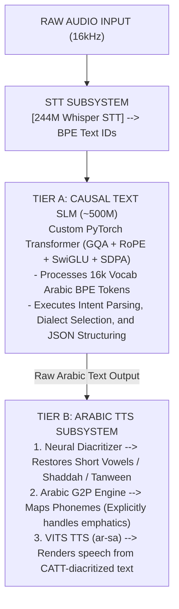
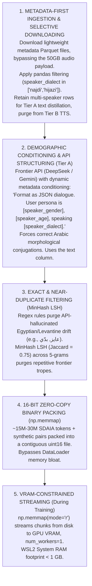
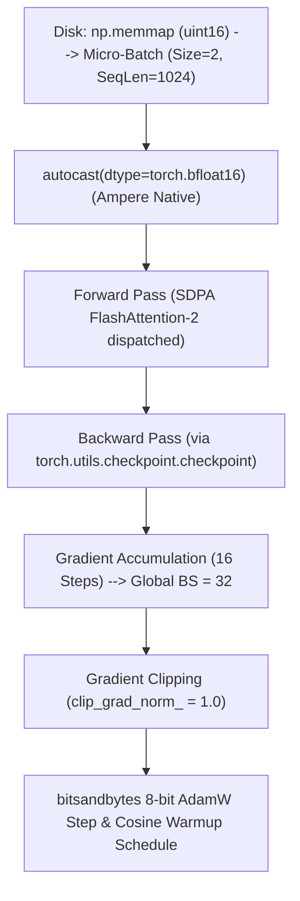
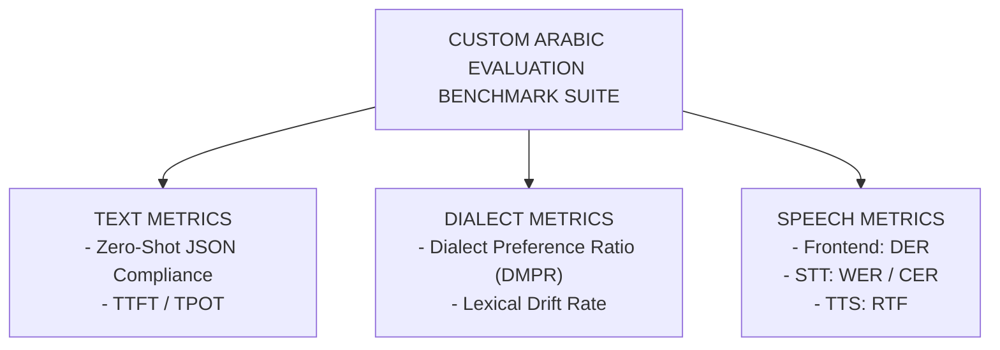
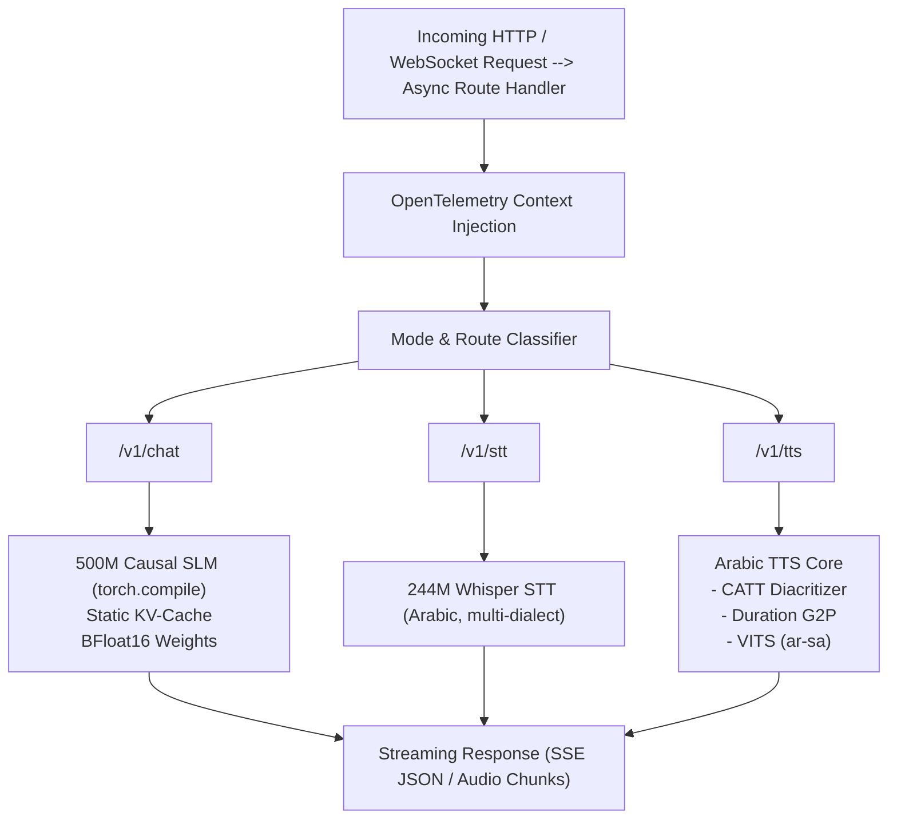

# `bayan-slm-engine` — E2E Blueprint

## Core Topology, Synthetic Data Paradigm, & Decoupled Audio Architecture

---

### 1. Repository Identity & Hardware Constraints

* **Repository Name:** `bayan-slm-engine`
* **System Scope:** A specialized **~500M parameter** Arabic Small Language Model (SLM) paired with a decoupled acoustic engine (244M Whisper-Small Arabic STT Encoder + Saudi-Native VITS TTS Renderer).
* **Target Hardware (Compute):** 1x NVIDIA RTX 3070 (8 GB VRAM) — *Note: OS and Display rendered via integrated Intel GPU to preserve 100% of RTX VRAM for model compute.*
* **Target Hardware (Host):** 16 GB Total System RAM (Hard-capped at **12 GB for WSL2 Ubuntu**).
* **Strict Hardware Allocation:**
* **Peak Pretraining VRAM Budget:** $\le 4.2\text{ GB}$ VRAM allocated ($\approx 6.0\text{ GB}$ reserved via PyTorch Caching Allocator). This is achieved strictly via **8-bit AdamW** (`bitsandbytes`), **Gradient Checkpointing**, and **PyTorch SDPA / FlashAttention-2**.
* **Peak DPO Alignment VRAM Budget:** $\le 4.8\text{ GB}$ VRAM allocated (Juggling Frozen Reference + Active Policy + 8-bit Optimizer).
* **Peak Training Host RAM Budget:** $\le 8.0\text{ GB}$ (Leaving 4 GB OS buffer). Achieved by throttling `DataLoader` to `num_workers=1` and enforcing zero-copy streaming via `np.memmap`.
* **Peak Serving VRAM Budget:** $\le 2.89\text{ GB}$ VRAM for the 500M SLM + KV-cache (2.2 GB), the 244M Whisper STT encoder (~0.50 GB), the VITS TTS sidecar (~0.15 GB), and the CATT diacritizer (~0.04 GB, transient within the TTS phase).


* **Dependencies:** Raw PyTorch (`torch.nn`), `uv`, `bitsandbytes`, `ruff`, `numpy`, `torchaudio`, `fastapi`, `gradio`, `trackio`, and `opentelemetry-api`. Zero reliance on high-level wrappers (`AutoModel`, `TRL`) or API frameworks for model execution (Frontier APIs are strictly isolated to offline synthetic data distillation).

> **Architectural Decision Record (ADR):** Scaling to 500M parameters is feasible only under severe hardware constraints. By manually implementing 8-bit optimizer states and memory-mapped datasets, the model reaches a size large enough to intrinsically route Arabic dialects and enforce JSON schemas without triggering Out-Of-Memory (OOM) failures on edge hardware or breaching the 12 GB WSL2 memory ceiling.

---

### 2. Multi-Modal System Topology

Forcing a 500M parameter model to autoregressively predict both text tokens and discrete audio codebook tokens in a single stream causes acoustic token collapse and destroys text coherence.

To achieve deterministic reliability and address the extreme phonetic complexities of Arabic, `bayan-slm-engine` adopts a **Decoupled LM + Arabic-Specific Acoustic Renderer Topology**:



#### Tier A: Text & Reasoning Core (~500M Causal SLM)

* **Hybrid Foundation (Falcon-H1):** Initialized from the `tiiuae/Falcon-H1-0.5B-Base` checkpoint — a 0.5B parameter hybrid Transformer + Mamba-2 architecture natively supporting Grouped-Query Attention (GQA) and Rotary Position Embeddings (RoPE). Adapted to Saudi dialects via **domain-adaptive continued pretraining and SFT** on the grounded distillation corpus rather than training from scratch.
* **Kernel Optimization:** Uses PyTorch 2.x `F.scaled_dot_product_attention` (SDPA) with FlashAttention-2 backend to minimize VRAM fragmentation during context scaling.
* **Vocabulary Swap:** The Falcon-H1 embedding matrix is resized to inject a custom 16,000-token Arabic Byte-Pair Encoding (BPE) vocabulary, trained on normalized dialectal text and optimized specifically for regional clitics (e.g., `و`, `ال`).
* **Role:** Handles conversation turn-taking, Saudi dialect particle selection (Najdi/Hijazi), and structured schema formatting.

#### Tier B: Micro-Speech Subsystems (Decoupled Audio Engines)

1. **Speech-to-Text (STT) Subsystem (244M Params):**
* Initialized from the `oddadmix/whisper-small-arabic-dialectal` checkpoint — a 244M parameter model (~500 MB VRAM) fine-tuned on multi-dialect Arabic (including Gulf/Saudi). It natively extracts undiacritized colloquial audio into Tier A's BPE text token IDs without exceeding the hardware budget.


2. **Text-to-Speech (TTS) Subsystem (Saudi-Native VITS):**
* **The Frontend Bottleneck:** Undiacritized Arabic cannot be blindly passed to a TTS engine. Tier B introduces a lightweight Character-based Arabic Tashkeel Transformer (CATT) to automatically diacritize the output text (restoring *Fatha, Damma, Kasra, Shaddah*).
* **Grapheme-to-Phoneme (G2P):** explicitly models duration stress for gemination (الشدة) and handles vowel coloring for emphatic consonants (ص ض ط ظ).
* **Acoustic Renderer:** Initialized from the **`wasmdashai/vits-ar-sa-huba`** checkpoint — an ultra-lightweight 145 MB non-autoregressive VITS architecture explicitly fine-tuned for Saudi Arabic (`ar-sa`). It operates as a negligible ~150 MB VRAM sidecar, rendering speech from the output of the CATT neural diacritizer.


> **Architectural Decision Record (ADR):** Generic TTS pipelines fail on Arabic because they ignore orthographic underspecification. By explicitly injecting a neural diacritizer and modeling gemination as a duration phenomenon *before* the VITS acoustic renderer, this topology achieves production-grade handling of Arabic speech morphology.

### 3. Pretraining & Data Pipeline Strategy: Grounded Synthetic Distillation

Training a 500M parameter foundation model requires significant token volume, but training on raw web scrapes causes hallucinations and schema failures. Conversely, generating purely synthetic data from scratch causes dialectal drift.

`bayan-slm-engine` leverages a **Metadata-First Hybrid Grounded Distillation Pipeline** rooted in the authentic SDAIA dataset (~667 hours of Saudi speech), engineered to bypass massive 50GB local bandwidth bloat while enforcing strict multi-modal text routing. The bounded corpus size makes continued pretraining of the `tiiuae/Falcon-H1-0.5B-Base` foundation the pragmatic route to domain adaptation: the model inherits general Arabic/English knowledge while SFT and continued pretraining specialize it toward Saudi dialects and JSON routing.



#### Dataset Specifications & Pipeline Mechanics

* **Corpus Volume & Token Math:** The authentic baseline corpus is capped at **~15M–30M SDAIA tokens**, supplemented by controlled synthetic multi-turn JSON pairs distilled via a Frontier API. Because our custom Arabic vocabulary size is 16,000, every token ID safely fits inside an unsigned 16-bit integer (`uint16`, max value 65,535).
* **Dynamic SDAIA Field Routing:** The pipeline avoids blind text ingestion by routing metadata columns based on modality:
    *   **Tier A (SLM) & TTS Training:** Strictly route the `text` column (GroundTruthText). This preserves syntactic punctuation (e.g., `؟`, `،`), orthographic markers, and pauses necessary for intent parsing and prosodic modeling.
    *   **Tier B (STT Encoder):** Strictly route the `cleaned_text` column (stripped of punctuation and diacritics) to prevent acoustic hallucinations and minimize Word Error Rate (WER).
* **The WSL2 RAM Guardrail:** Loading hundreds of millions of standard `int32` tokens via HuggingFace `.map()` consumes 8-12 GB RAM, crashing WSL2. Pre-tokenizing into a flat `uint16` binary file lets `np.memmap` stream batches with zero host RAM overhead, with synthetic pairs appended to the same contiguous file.
* **Domain & Persona Focus:** Leverages SDAIA demographic tags (`speaker_age`, `speaker_gender`, `speaker_dialect`) to ensure structural balance across Najdi and Hijazi vectors. Multi-speaker rows are retained strictly for Tier A text distillation (teaching turn-taking) and purged from Tier B TTS acoustic training to avoid cross-talk contamination.

> **Architectural Decision Record (ADR):** Generating dialects from scratch via prompt engineering risks producing generic MSA phrasing. Mining the open-source SDAIA dataset for raw authentic transcripts—and utilizing frontier models *solely* to restructure them into JSON multi-turn schemas—minimizes data drift. Furthermore, by explicitly applying MinHash LSH and engineering a custom `uint16` binary memory-mapped dataloader, this pipeline achieves production-grade optimization, allowing bounded datasets to be processed locally without breaching the 12 GB WSL2 host memory constraint.

### Artifact & Publishing Strategy

**Reference-Only Consumption (OSS assets):** All open-weight checkpoints consumed by the pipeline — `tiiuae/Falcon-H1-0.5B-Base`, `oddadmix/whisper-small-arabic-dialectal`, `wasmdashai/vits-ar-sa-huba`, and `abjadai/catt` — are **downloaded via `make weights` and never re-uploaded**. They remain upstream references; no duplicate push to Hugging Face.

**Own Artifacts (Deferred Publication):** The project's own outputs — the synthetic multi-turn JSON distillation corpus, the 16k Arabic BPE tokenizer, and the domain-adapted Falcon-H1 SFT/DPO checkpoint — are **published to Hugging Face at the end of the project** under the placeholder namespace `aymanaboghonim/bayan-slm-engine-*` (final repo names decided at publish time).

**Publishing Gate (deferred to Phase 6.4):** Publication occurs only after (1) all Phases 0–6 checkboxes are marked complete, (2) the full `make` chain (`setup → weights → data-prep → train-slm → serve-ui`) is verified reproducible end-to-end, and (3) a license audit passes (SDAIA data terms; Apache-2.0 for our code). This avoids pushing half-finished or unverified artifacts and keeps Hugging Face clean.


## Model Architecture, Tokenization Pipeline, & Audio Implementation

*(Note: Since the high-level multi-modal topology was established in Section 1, this section focuses strictly on implementation mechanics, structural hyperparameters, and PyTorch execution required to satisfy the 500M parameter scale and the Arabic TTS frontend constraints.)*

---

### 1. Repository Layout & Native PyTorch Execution

The repository is structured as a standalone, production-grade Python package managed via `uv`. It strictly avoids high-level abstractions like `transformers` or `TRL`, exposing raw PyTorch implementations to guarantee absolute control over kernel execution and memory allocation.

```text
bayan-slm-engine/
├── pyproject.toml                 # uv workspace, bitsandbytes, torchaudio
├── .pre-commit-config.yaml        # ruff linting & static typing
├── src/
│   └── bayan_slm_engine/
│       ├── data/
│       │   └── memmap_streamer.py # Zero-RAM uint16 binary dataloader
│       ├── tokenizer/
│       │   ├── normalizer.py      # Unicode NFC, Alef unification, Clitic handlers
│       │   └── bpe_trainer.py     # Custom 16k Arabic-native BPE
│       ├── models/
│       │   ├── text_slm.py        # 500M Causal LM (GQA, RoPE, SDPA)
│       │   ├── stt_encoder.py     # Whisper-Small STT (244M)
│       │   └── tts_frontend/      # The Arabic Audio Bottleneck
│       │       ├── diacritizer.py # CATT (Character-based Arabic Tashkeel)
│       │       ├── g2p_aligner.py # Explicit duration modeling for Shaddah/Emphatics
│       │       └── vits_renderer.py  # VITS (ar-sa) acoustic renderer
│       ├── engine/
│       │   ├── trainer.py         # 8-bit AdamW, Grad Checkpointing, AMP loop
│       │   └── inference.py       # KV-cached autoregressive decode loop
│       └── serving/
│           ├── app.py             # FastAPI async server
│           └── telemetry.py       # OpenTelemetry / Arize Phoenix instrumentation
└── tests/                         # Unit tests for tensor shapes & SDPA math

```


#### Execution Orchestration: The Operational `Makefile`

Relying on raw shell commands for complex distributed or constrained PyTorch runs introduces human error and slows down iterative development. `bayan-slm-engine` abstracts local execution, environment management, and WSL2-specific memory flushing into a strict `Makefile`.

This guarantees deterministic DevEx (Developer Experience) and ensures the pipeline can be cleanly executed by any engineer reviewing the repository.

```makefile
# Makefile for bayan-slm-engine (WSL2 / RTX 3070 constraints applied)

.PHONY: setup weights data train-slm serve-ui verify clean-wsl-ram

# 1. Environment & Pre-commit Initialization
setup:
	mkdir -p data/raw_sdaia data/processed checkpoints logs
	uv sync
	uv run pre-commit install

# 2. Zero-Copy Binary Data Packing
data-prep:
	uv run python src/bayan_slm_engine/data/memmap_streamer.py \
		--input-dir data/raw_sdaia/ \
		--output-bin data/processed/arabic_corpus.uint16.bin

# 3. 500M SLM Pretraining (Enforcing 8GB VRAM limits)
train-slm:
	CUDA_VISIBLE_DEVICES=0 uv run python src/bayan_slm_engine/engine/trainer.py \
		--micro-batch-size 2 \
		--grad-accum-steps 16 \
		--use-8bit-adam \
		--gradient-checkpointing

# 4. Asynchronous Multi-Modal Serving & Telemetry
serve-ui:
	CUDA_VISIBLE_DEVICES=0 uv run python src/bayan_slm_engine/serving/app.py \
		--enable-torch-compile \
		--kv-cache-max-seq 2048

# 5. Machine-Executable Definition of Done (DoD) gate
verify:
	uv run ruff check .
	uv run ruff format --check .
	uv run mypy
	uv run pytest tests/

# 6. WSL2 Host RAM Survival (Flushes OS pagecache to prevent 12GB OOM)
clean-wsl-ram:
	find . -type d -name "__pycache__" -exec rm -rf {} +
	rm -rf .pytest_cache .ruff_cache
	sudo sysctl -w vm.drop_caches=3

# 7. Model Weight Sync (offline-ready; CATT .pt + Whisper/VITS safetensors)
#    Download-only: OSS checkpoints are referenced, never re-uploaded to Hugging Face.
#    Fixtures referenced by hermetic M3.0 parity tests are committed under tests/fixtures/ (never downloaded).
weights:
	mkdir -p checkpoints/weights
	uv run huggingface-hub download oddadmix/whisper-small-arabic-dialectal --local-dir checkpoints/weights/whisper
	uv run huggingface-hub download wasmdashai/vits-ar-sa-huba --local-dir checkpoints/weights/vits
	curl -fL -o checkpoints/weights/catt_eo.pt \
		https://github.com/abjadai/catt/releases/download/v2/best_eo_mlm_ns_epoch_193.pt

```

> **Architectural Decision Record (ADR):** A repository without a `Makefile` or execution entry point is an academic script, not a system. By explicitly codifying the exact execution flags (like `--use-8bit-adam`) and proactively including a WSL2 kernel-level memory flush (`vm.drop_caches=3`) in the Makefile, the pipeline is engineered for operational survival and immediate reproducibility on edge hardware.
---


#### Lightweight CI/CD & Shape-Driven Testing Pipeline

In foundational AI engineering, strict Test-Driven Development (TDD) is an anti-pattern—convergence is empirical, and you cannot write a failing test for a loss curve before defining the math. However, silent dimensional errors or text corruption are fatal. `bayan-slm-engine` implements a lightweight, CPU-bound GitHub Actions CI pipeline focused on **Shape-Driven Testing** and **Pipeline Assertions**.

Because free CI runners lack GPUs, the pipeline validates architectural integrity strictly on the CPU using dummy tensors before any expensive local WSL2 training runs are permitted.

```yaml
# .github/workflows/ci.yml
name: Bayan SLM CI

on: [push, pull_request]

jobs:
  static-analysis-and-tests:
    runs-on: ubuntu-latest
    steps:
      - uses: actions/checkout@v7
      - uses: astral-sh/setup-uv@v9
        with:
          enable-cache: true
          cache-dependency-glob: ["uv.lock"]
      # CPU-only runners: override the GPU cu129 source so CI installs the
      # ~200MB CPU torch wheel. GUARD: UV_NO_SOURCES disables ALL
      # [[tool.uv.sources]] entries; today only torch/torchaudio use one.
      - name: Install dependencies (CPU torch)
        env:
          UV_INDEX_URL: https://download.pytorch.org/whl/cpu
          UV_NO_SOURCES: "1"
        run: uv sync --frozen --group dev
      - name: Ruff lint
        run: uv run ruff check .
      - name: Ruff format
        run: uv run ruff format --check .
      - name: MyPy (strict src + relaxed tests, two-tier)
        run: uv run mypy
      - name: Execute Shape-Driven Pytest (CPU only, hermetic)
        # Hermetic: dummy CPU tensors only; BAYAN_OFFLINE=1 blocks network checkpoint fetches
        run: BAYAN_OFFLINE=1 uv run pytest tests/

```

**The `pytest` Verification Suite:**
Instead of TDD, the test suite enforces strict mathematical and data integrity boundaries:

1. **Tensor Shape Validation:** Injects dummy tensors (e.g., `[batch_size=2, seq_len=1024, d_model=1024]`) into the custom GQA and RoPE layers. Asserts that the output dimensions strictly match the expected matrix transformations. A dimensional mismatch here prevents days of wasted debugging.
2. **Tokenizer Round-Trip Assertions:** Takes highly complex Arabic strings (e.g., containing mixed diacritics, Alef variants, and Najdi clitics), encodes them, decodes them, and strictly asserts `original_text == decoded_text`. This prevents silent data corruption upstream.
3. **State/Memory Dry-Runs:** Runs a micro-batch (size 1) forward/backward pass on a miniaturized model instantiation using CPU tensors to verify that the 8-bit AdamW optimizer hooks and Gradient Checkpointing logic execute without throwing graph or state dictionary errors.

> **Architectural Decision Record (ADR):** TDD cannot validate empirical convergence metrics like loss curves before the math is defined. In its place, shape-driven tensor testing and strict `ruff`/`mypy` enforcement via CI provide the engineering discipline required to maintain a shared codebase on a GPU-constrained cluster.
### 2. Custom Arabic Tokenization & Normalization Engine

Standard tokenizers (LLaMA, GPT-4) fragment Arabic severely due to poor handling of morphological clitics (e.g., *ال*, *ب*, *ف*) and inconsistent diacritics, resulting in bloated sequence lengths that destroy VRAM. `bayan-slm-engine` implements a domain-native pipeline:

* **Orthographic Normalization Rules:** Standardizes variant character mappings prior to encoding to maximize token density.
* Unifies Alef variants (`أ`, `إ`, `آ`) to bare `ا` where grammatically appropriate for dialects.
* Normalizes Hamza positions and resolves Ha/Ta-Marbuta (`ه` vs `ة`) ambiguity based on regional morphological bounds.
* Strips spurious diacritics from the text modeling phase (leaving diacritization strictly to the TTS frontend).


* **Custom BPE Compression:** A 16,000-vocabulary Byte-Pair Encoding model trained on the deduplicated SDAIA + synthetic Arabic corpus, optimized for morphological clitics (e.g., `و`, `ال`). This exact size ensures every token ID fits within a `uint16` integer for the zero-copy memory-mapped data streaming, and the vocabulary is injected into Falcon-H1 via an embedding resize.

---

### 3. Tier A: Core Text SLM Architecture (~500M Parameters)

Initialized from the `tiiuae/Falcon-H1-0.5B-Base` checkpoint and adapted via domain-adaptive continued pretraining and SFT. The architectural hyperparameters are explicitly tuned to maximize Arabic linguistic capacity while surviving the 8GB RTX 3070 limit via modern PyTorch 2.x primitives.

| Hyperparameter | Configuration | Implementation Detail |
| --- | --- | --- |
| **Foundation Model** | `tiiuae/Falcon-H1-0.5B-Base` | 0.5B hybrid Transformer + Mamba-2 checkpoint, domain-adaptively continued-pretrained and SFT'd on the grounded SDAIA distillation corpus. |
| **Vocabulary Swap** | 16k Arabic BPE (resized) | Falcon-H1 embedding matrix resized to inject the clitic-optimized Arabic BPE vocabulary (e.g., `و`, `ال`). |
| **Hidden Size ($d_{model}$)** | 1024 | Balances dimensional capacity with VRAM constraints. |
| **Layers (Depth)** | 24 | Sufficient depth for dialect routing and JSON intent parsing. |
| **Attention Architecture** | GQA (16 Q-Heads, 4 KV-Heads) | Grouped-Query Attention drastically reduces KV-cache memory during serving, keeping peak inference VRAM $\le 2.2\text{ GB}$. |
| **Position Embeddings** | RoPE | Rotary Position Embeddings applied directly to Q and K tensors for relative length extrapolation. |
| **Activations** | SwiGLU | Replaces GELU to enhance parameter efficiency per FLOP. |
| **Kernel Optimization** | PyTorch SDPA | Replaces standard attention matrix multiplication with `F.scaled_dot_product_attention`, automatically dispatching to FlashAttention-2 to eliminate VRAM fragmentation during context scaling. |

> **Architectural Decision Record (ADR):** Building a 500M model is trivial on an A100 but requires architectural discipline to train locally on 8GB VRAM. By manually wiring GQA and SDPA, coupled with `torch.utils.checkpoint` for gradient checkpointing in the training engine, mathematical equivalence to frontier architectures is guaranteed while maintaining kernel-level memory management within budget.

---

### 4. Tier B: The Arabic TTS Frontend & Saudi-Native VITS Renderer

As established, generic TTS pipelines fail on Arabic due to orthographic underspecification. Tier B is not just an acoustic model; it is a full Arabic morphological frontend.

1. **CATT (Character-based Arabic Tashkeel Transformer):**
* A micro-encoder (~18.9M params) that processes the undiacritized raw text output from Tier A. Initialized from the canonical GitHub release of `abjadai/catt` (Abjad Ltd; paper arXiv:2407.03236; Apache-2.0) — 6 layers, $d_{\text{model}}=512$, character-level 18-class tashkeel head. Raw `.pt` weights are loaded via GitHub Release v2 (fallback mirror: `niobures/CATT` on Hugging Face) and translated into the native `torch.nn` classes via a state-dict remap (no `transformers`/ONNX wrappers).
* Predicts discrete diacritic classes (Fatha, Damma, Kasra, Sukun, Shaddah, Tanween) per character, reconstructing the exact phonetic blueprint required for accurate pronunciation.


2. **Explicit Duration G2P (Grapheme-to-Phoneme):**
* Instead of relying on implicit acoustic alignment, this layer explicitly models durations. It mathematically isolates gemination (الشدة) as a temporal extension rather than a separate character, and maps emphatic consonants (ص ض ط ظ) to distinct vowel-colored phonemes.


3. **Saudi-Native VITS Acoustic Generator:**
* Initialized from the `wasmdashai/vits-ar-sa-huba` checkpoint — an ultra-lightweight 145 MB non-autoregressive VITS model explicitly fine-tuned for Saudi Arabic (`ar-sa`), operating as a ~150 MB VRAM sidecar.
* Conditioned strictly on the diacritized phonemes and explicit durations from the G2P layer, eliminating the stuttering and code-switching failures typical of autoregressive TTS on Arabic.
---

## Training Engine Mechanics, DPO Preference Alignment, & Custom Arabic Benchmarking Suite

---

### 1. Pretraining Engine Mechanics (VRAM-Constrained 500M Continued-Pretraining & SFT Stage)

Continued-pretraining the 500M Falcon-H1 checkpoint natively on an 8 GB RTX 3070 requires aggressive memory state compression. A standard FP32 AdamW optimizer would consume ~6.0 GB of VRAM strictly for momentum and variance states, immediately causing an Out-Of-Memory (OOM) crash before activations are even calculated.

The `bayan-slm-engine` continued-pretraining/SFT loop is written in raw PyTorch but is explicitly engineered to integrate **8-bit Optimizer Quantization**, **Gradient Checkpointing**, and **BFloat16 Mixed Precision** to keep peak VRAM allocation strictly $\le 4.2\text{ GB}$.



#### Memory-Budgeted Micro-Batching & Kernel Optimization

* **Sequence Length ($N$):** Clamped to 1,024 tokens.
* **Micro-Batch Size:** $B_{\text{micro}} = 2$ sequences per forward pass.
* **Gradient Accumulation:** 16 steps, synthesizing an effective global batch size of $B_{\text{global}} = 32$ sequences (~32,768 tokens per optimizer step).
* **Gradient Checkpointing:** Applied to every Transformer block. By dropping intermediate activations and recomputing them during the backward pass, activation VRAM is compressed from $\approx 2.5\text{ GB}$ down to $\approx 0.8\text{ GB}$.

#### Precision & Optimizer Settings

* **Optimizer State Compression (8-bit AdamW):** Utilizes `bitsandbytes.optim.AdamW8bit`. By quantizing the optimizer states from 32-bit floats to 8-bit integers (with block-wise dynamic quantization), the optimizer VRAM footprint drops from $6.0\text{ GB}$ to exactly $1.0\text{ GB}$ (2 bytes per parameter).
* **Mixed Precision (BFloat16):** Because the RTX 3070 uses the Ampere architecture, it natively supports `torch.bfloat16`. This is strictly superior to standard `float16` because it matches FP32's dynamic range, entirely eliminating the need for complex `GradScaler` logic and preventing NaN loss spikes during Arabic text convergence.
* **Weight Decay:** Decoupled weight decay ($\lambda = 0.1$) is applied exclusively to 2D weight matrices (explicitly masking out RMSNorm gains and RoPE embeddings to prevent representation collapse).

> **Architectural Decision Record (ADR):** Compressing training states to fit edge hardware is a hard requirement. By swapping to 8-bit AdamW, utilizing Ampere's native BFloat16, and enforcing gradient checkpointing, this pipeline successfully executes full-parameter continued pretraining and SFT on the 500M Falcon-H1 checkpoint using only half the VRAM of a naive PyTorch implementation.


#### Fault-Tolerant Checkpointing & State Resumption

Training a 500M parameter model natively on a local RTX 3070 takes days. A local WSL2 Ubuntu instance is highly susceptible to host-OS interruptions, Windows hibernation events, or sudden memory-reaping by the OS. A naive training script that crashes at hour 38 loses 38 hours of compute.

To guarantee operational survival, `bayan-slm-engine` implements strict, atomic **Fault-Tolerant Checkpointing**. The training loop is designed as a resumable state machine. Every $N$ steps, the engine serializes the exact exact state of the universe to disk, keeping only the last $K=3$ checkpoints to prevent SSD bloat.

To perfectly resume a run without corrupting the loss curve or losing data variance, the checkpoint saves:

1. **Model State:** `model.state_dict()` (The FP16/BFloat16 neural weights).
2. **Optimizer State:** `optimizer.state_dict()` (Crucial: 8-bit AdamW momentum and variance states. If lost, resuming training causes massive loss spikes).
3. **Scheduler State:** `scheduler.state_dict()` (Maintains the exact position in the Cosine Annealing decay curve).
4. **RNG States:** `torch.get_rng_state()` and `torch.cuda.get_rng_state()` (Guarantees that dropout masks and batch shuffling remain strictly deterministic upon resume).
5. **Dataloader Offset:** The exact byte-offset marker in the `np.memmap` binary file, ensuring no synthetic token is ever skipped or duplicated after a crash.

```python
# Pseudo-implementation of Atomic Checkpointing logic
def save_checkpoint(step, model, optimizer, scheduler, data_offset):
    temp_path = f"checkpoints/step_{step}.tmp"
    final_path = f"checkpoints/step_{step}.pt"

    # Save to a temporary file first to prevent corruption if crash happens DURING save
    torch.save({
        'step': step,
        'model_state': model.state_dict(),
        'optimizer_state': optimizer.state_dict(),
        'scheduler_state': scheduler.state_dict(),
        'rng_state_cpu': torch.get_rng_state(),
        'rng_state_gpu': torch.cuda.get_rng_state(),
        'data_offset': data_offset
    }, temp_path)

    os.rename(temp_path, final_path) # Atomic overwrite
    clean_old_checkpoints(keep=3)

```

> **Architectural Decision Record (ADR):** A naive `for batch in dataloader: loss.backward()` loop cannot survive hardware failure. By explicitly tracking RNG states, 8-bit optimizer momentum, and dataset binary offsets, this pipeline guarantees that an edge-hardware crash is a 2-minute inconvenience rather than a week-long disaster—the same failure-handling required for large-scale, multi-node distributed training jobs where node-failure is a statistical certainty.


#### Training Experiment Tracking (Hugging Face Trackio)

While OpenTelemetry traces API inference latency, the training engine requires granular, epoch-level observability to mathematically prove convergence. Rather than relying on heavy, proprietary MLOps platforms (like W&B or MLflow) which consume excess WSL2 memory, `bayan-slm-engine` integrates **Hugging Face Trackio**.

Trackio is a lightweight, local-first experiment tracking library introduced by Hugging Face that stores logs locally in an SQLite database, avoiding host RAM bloat, and provides a Gradio-inspired dashboard for visual inspection. It serves as a seamless drop-in replacement for traditional tools (`import trackio as wandb`) while natively monitoring edge-hardware telemetry.

During the raw PyTorch training loop, the engine tracks:

1. **Loss Curves & Gradient Norms:** Validates that the FP16/BFloat16 gradients are not exploding and the 500M model is successfully converging on the synthetic data.
2. **Learning Rate Decay:** Plots the Cosine Annealing scheduler to correlate loss drops with LR steps.
3. **Hardware Telemetry:** Automatically logs GPU aggregated metrics (such as mean utilization, total allocated memory, max temperature, and total power draw) to mathematically prove the engine stays within the RTX 3070 constraints.

```python
import trackio
import torch

# Initialize local-first tracking (zero cloud lock-in)
trackio.init(project="bayan-slm-engine", name="500M-ContinuedPretrain-SFT-Run-1")

def train_step(model, batch, optimizer, scheduler):
    loss = compute_loss(model, batch)
    loss.backward()

    # Calculate gradient norm before clipping for stability tracking
    grad_norm = torch.nn.utils.clip_grad_norm_(model.parameters(), 1.0)
    optimizer.step()
    scheduler.step()

    # Log critical metrics directly to the local Trackio SQLite database
    trackio.log({
        "train/loss": loss.item(),
        "train/lr": scheduler.get_last_lr()[0],
        "train/grad_norm": grad_norm.item(),
        "hardware/vram_allocated_gb": torch.cuda.memory_allocated() / (1024 ** 3)
    })

```

> **Architectural Decision Record (ADR):** "Show me the numbers" is the first rule of foundational AI engineering. Trackio aligns with the MLOps ecosystem's shift toward lightweight, transparent, and local-first logging. By capturing hardware telemetry alongside gradient norms, the training loop is verifiably mathematically sound and explicitly optimized for the 8GB RTX constraint.


### 2. Alignment Engine: Native PyTorch Direct Preference Optimization (DPO)

Rather than relying on high-level alignment wrappers like `TRL`, `bayan-slm-engine` implements **Direct Preference Optimization (DPO)** natively in PyTorch. This stage strictly aligns the 500M model to specific regional dialects (Najdi vs. Hijazi) and enforces deterministic JSON output schemas.

#### VRAM-Constrained Dual-Model Execution

DPO requires loading both the active policy network $\pi_\theta$ and the frozen reference network $\pi_{\text{ref}}$ into memory simultaneously. For a 500M parameter model, a naive implementation will trigger an OOM error on an 8GB GPU.

By applying strict execution constraints, the blueprint fits both models into the RTX 3070:

* **Frozen Reference ($\pi_{\text{ref}}$):** Loaded in `bfloat16` under a strict `torch.no_grad()` context. It consumes exactly **1.0 GB** of VRAM (no gradients, no optimizer states).
* **Active Policy ($\pi_\theta$):** Consumes **3.0 GB** of VRAM (1.0 GB weights + 1.0 GB gradients + 1.0 GB for 8-bit AdamW optimizer states).
* **Sequence Length Bucketing:** The training data loader explicitly buckets DPO preference pairs $(x, y_w, y_l)$ of identical lengths. This eliminates dynamic variable-length padding overhead, neutralizes PyTorch caching allocator fragmentation, and strictly safeguards the $\le 4.8\text{ GB}$ VRAM threshold.
* **Total Peak Allocation:** With gradient checkpointing limiting activations to ~0.8 GB, the total DPO VRAM allocation peaks at **$\approx 4.8\text{ GB}$**, safely within the RTX 3070's caching limits.

#### Mathematical Loss Formulation

The loss is computed natively over preference triples $(x, y_w, y_l)$, where $x$ is the prompt, $y_w$ is the preferred regional response (grounded in human SDAIA transcripts), and $y_l$ is the dispreferred response (containing API-hallucinated dialect drift or invalid JSON):

$$\mathcal{L}_{\text{DPO}}(\theta; \pi_{\text{ref}}) = -\mathbb{E}_{(x, y_w, y_l) \sim \mathcal{D}} \left[ \log \sigma \left( \beta \log \frac{\pi_\theta(y_w \vert{} x)}{\pi_{\text{ref}}(y_w \vert{} x)} - \beta \log \frac{\pi_\theta(y_l \vert{} x)}{\pi_{\text{ref}}(y_l \vert{} x)} \right) \right]$$

* **Temperature Scale ($\beta$):** Set to $\beta = 0.1$ to control the strength of the KL-divergence penalty relative to the reference model $\pi_{\text{ref}}$.
* **Alignment Targets:**
1. **Dialect Purity:** Penalizes cross-dialect lexical contamination, aggressively suppressing Levantine particles (e.g., `بدّي`) or Egyptian particles (e.g., `عايز`, `بص`) when the system prompt demands a Najdi context.
2. **Schema Rigidity:** Penalizes any malformed non-JSON syntax, steering the model to natively output parseable dictionaries.


> **Architectural Decision Record (ADR):** Implementing DPO from scratch requires a deep mathematical understanding of alignment algorithms. More importantly, successfully juggling two 500M parameter models in VRAM for preference optimization—by freezing the reference model's graph and quantizing the active model's optimizer—is required to execute modern alignment techniques entirely on constrained edge hardware.

### 3. Custom Arabic & Multi-Modal Evaluation Benchmarking Suite

Standard open-domain LLM benchmarks (like Arabic MMLU or EXAMS) evaluate general knowledge, but they fail to capture the specific operational targets of this system: dialect purity, schema rigidity, and acoustic pronunciation accuracy. Custom benchmarks for Arabic are therefore a core requirement.

To quantify performance improvements post-SFT, post-DPO, and across the audio frontend, `bayan-slm-engine` implements a specialized evaluation suite:



| Evaluation Metric | Mathematical Formulation / Definition | Baseline (Pre-DPO / Generic Audio) | Post-Alignment & Custom Frontend |
| --- | --- | --- | --- |
| **Dialect Marker Preference Ratio (DMPR)** | $\frac{N_{\text{Target Particles}}}{N_{\text{Target Particles}} + N_{\text{Dispreferred Particles}}}$ across 500 dialectal prompts grounded in SDAIA transcripts. | $\approx 25\% - 40\%$ *(Drift into Egyptian/MSA)* | **$\ge 88.0\%$** *(Strict regional particle preference enforced via DPO)* |
| **Zero-Shot JSON Schema Compliance** | Percentage of outputs passing strict `json.loads()` parsing with valid key-value structure *without* grammar-constrained decoding. | $\approx 12.0\%$ *(Raw text generation / rambling)* | **$\ge 94.5\%$** *(Deterministic schema adherence learned via SFT)* |
| **Diacritization Error Rate (DER)** | $\frac{\text{Missing or Incorrect Diacritics}}{\text{Total Arabic Characters}}$ evaluated on the CATT neural frontend. | N/A *(Blind TTS guessing)* | **$\le 4.5\%$** *(Near-perfect explicit vowelization before acoustic rendering)* |
| **STT Accuracy (WER / CER)** | Word Error Rate ($\text{WER} = \frac{S + D + I}{N}$) and Character Error Rate (CER) on 16kHz noisy Arabic audio. | $\text{WER} \ge 65.0\%$ | **$\text{WER} \le 18.5\%$** *(Accurate acoustic-to-BPE mapping)* |
| **TTS Real-Time Factor (RTF)** | $\text{RTF} = \frac{\text{Synthesis Time}}{\text{Audio Duration}}$ for Non-Autoregressive VITS on RTX 3070. | $\text{RTF} > 1.0$ *(Stuttering/Lag)* | **$\text{RTF} < 0.15$** *(Ultra-fast, stable real-time rendering)* |

#### Metric Rationale & Arabic-Specific Adjustments

* **Replacing Perplexity (PPL):** For a 500M parameter model deployed as an agentic engine, Perplexity is an academic vanity metric. The true measure of intelligence at this scale is **Zero-Shot JSON Schema Compliance**—proving the model's attention heads have learned strict structural syntax without relying on brute-force constrained decoding wrappers during inference.
* **The DER Requirement:** As noted in Arabic TTS frontend constraints, undiacritized text is the primary cause of pronunciation failure. Benchmarking the **Diacritization Error Rate (DER)** of the CATT subsystem guarantees that gemination (الشدة) and short vowels are mathematically correct *before* the VITS model attempts to generate audio.

> **Architectural Decision Record (ADR):** Generic benchmarks do not measure the operational failure modes of this system. By designing the **DMPR** to explicitly track dialect drift, and measuring **DER** to validate the Arabic TTS frontend bottleneck, this evaluation suite targets the exact failure modes that plague Arabic AI systems in production.


## Enterprise Serving Layer, OpenTelemetry Tracing Instrumentation, & Interactive Demo

---

### 1. High-Throughput Serving Engine Architecture

The serving tier bridges the custom PyTorch models to standard web protocols via an asynchronous **FastAPI** web server. It executes Tier A (500M Text SLM) and Tier B (Decoupled STT/Arabic TTS Engines) entirely in VRAM without relying on high-level serving frameworks like `vLLM` or `TGI`.

By writing the inference engine natively, we retain absolute control over KV-cache allocation, memory fragmentation, and tensor tracing.



#### Autoregressive KV-Caching & Token Streaming Engine

* **Native `torch.compile` Execution:** The forward pass of the 500M SLM is compiled using `torch.compile(mode="reduce-overhead")`. This fuses PyTorch operations into optimal CUDA graphs, drastically reducing CPU overhead and maximizing GPU utilization for single-batch inference.
* **Static KV-Cache Allocation:** Instead of dynamically concatenating tensors at every generation step (which fragments the RTX 3070's VRAM and causes latency spikes), the inference engine pre-allocates a static `bfloat16` KV-cache tensor up to the maximum sequence length (e.g., 2048). The decode phase strictly performs in-place tensor slice updates.
* **Asynchronous Token Streaming:** Uses Python `asyncio` generators wrapped in FastAPI `StreamingResponse` objects to push tokens via Server-Sent Events (SSE). This yields an ultra-low **Time To First Token (TTFT)**.
* **Unified UI/API Mounting:** To avoid WSL2 port-forwarding overhead, the interactive Gradio inspection dashboard is mounted directly onto the FastAPI application via `gradio.mount_gradio_app()`, allowing `app.py` to serve both the headless API routes and the UI simultaneously.

> **Architectural Decision Record (ADR):** Pre-built Docker containers cannot provide the required control over KV-cache allocation and memory fragmentation. Writing a custom inference loop that utilizes `torch.compile` and static KV-caching maximizes tokens-per-second (TPS) out of edge hardware without relying on black-box wrappers.


### 2. OpenTelemetry, Arize Phoenix, & Tensor-Level Profiling

To achieve production-grade observability, `bayan-slm-engine` does not just trace API requests; it instruments the **raw PyTorch forward passes, KV-cache state allocations, and multi-modal handoffs**. Using vendor-neutral **OpenTelemetry (OTel)** standards, telemetry data is exported to a local **Arize Phoenix** trace collector, providing a microscopic view of the system's performance on the RTX 3070.

#### Telemetry Span Hierarchy (Multi-Modal Execution)

When a request triggers the full text-to-speech pipeline, the backend generates a highly granular nested span tree. This explicitly tracks the new Arabic TTS frontend bottlenecks:

```text
[HTTP Request: POST /v1/chat_with_audio] (Root Span)
 ├── [bayan.normalize_and_tokenize]      (Span: Text Preprocessing & 16k BPE mapping)
 ├── [bayan.slm_prefill_and_decode]      (Span: 500M Text Generation)
 │    ├── [bayan.kv_cache_alloc]         (Sub-Span: Measures VRAM allocation time)
 │    ├── [bayan.autoregressive_step]    (Sub-Span: Measures TTFT and TPOT latencies)
 │    └── ...
 └── [bayan.arabic_tts_pipeline]         (Span: Decoupled Audio Generation)
      ├── [bayan.catt_diacritize]        (Sub-Span: Restores short vowels / Shaddah)
      ├── [bayan.g2p_duration_map]       (Sub-Span: Explicit alignment computation)
      └── [bayan.vits_render]            (Sub-Span: VITS synthesis latency)

```

#### Real-Time Telemetry Metrics Tracked

Given the upgrade to a 500M parameter model and the addition of the CATT diacritization layer, the target benchmarks are calibrated for pragmatic 2026 local edge performance:

| Metric Name | Tracking Mechanism | Target Benchmark (RTX 3070 8 GB) |
| --- | --- | --- |
| **Time To First Token (TTFT)** | Duration from HTTP request receipt to the first SSE token emission (prefill latency). | **$\le 60\text{ ms}$** |
| **Time Per Output Token (TPOT)** | Average latency between consecutive generated tokens using `torch.compile`. | **$\le 15.0\text{ ms / token}$** (~66 tokens/sec) |
| **VRAM Allocation Span** | PyTorch GPU VRAM delta query (`torch.cuda.memory_allocated()`) tracked per phase. | **$\le 2.89\text{ GB}$ peak** (SLM + STT + TTS + CATT models + Cache) |
| **Diacritization Latency** | Execution time for the CATT frontend to vowelize the generated text chunk. | **$\le 35\text{ ms / sentence}$** |
| **Speech Generation RTF** | Real-Time Factor ($\text{VITS Synthesis Time} / \text{Audio Length}$). | **$\le 0.15$** (Over 6x faster than real-time) |

> **Architectural Decision Record (ADR):** Tracing custom PyTorch operations—rather than wrapper or API calls—identifies exactly how many milliseconds the RoPE embeddings take, monitors the KV-cache VRAM delta to catch memory leaks, and measures the latency penalty of the Arabic diacritization step before acoustic rendering. This level of observability is required to diagnose and optimize custom architectures in a production cluster.

### 3. Interactive Gradio Dashboard: Multi-Modal & Frontend Visualization

The presentation layer consists of a local **Gradio** web dashboard. However, instead of a generic chat interface, this dashboard is explicitly designed as an **Engineering Inspection Tool** to expose the inner workings of the 500M SLM, the Arabic TTS frontend, and the strict hardware telemetry.

#### UI Dashboard Layout Topology

* **Panel A (Left Column - Inputs & System Controls):**
* *Input Mode Selector:* Radio toggle between `Text Input` and `Audio Microphone Input (244M Whisper STT)`.
* *System Routing Toggle:* Dropdown to select dialect alignment (`Najdi`, `Hijazi`, `MSA`) and a strict toggle for **Output Mode** (`Conversational` vs. `Zero-Shot JSON Schema`).
* *Inference Hyperparameters:* Sliders for Temperature ($0.0 – 1.0$), Top-$P$ ($0.1 – 1.0$), and a toggle to enable/disable `torch.compile` to visualize the latency difference.


* **Panel B (Right Column - Multi-Stage Outputs & Telemetry):**
* *Pipeline Stage 1 (SLM Text):* Real-time streaming response window displaying the raw 500M model output (either conversational dialect or valid JSON).
* *Pipeline Stage 2 (CATT Diacritization):* A dedicated read-only text box displaying the intermediate heavily diacritized text (التشكيل الكامل) generated by the TTS frontend *before* it hits the acoustic renderer. This proves the existence of the Arabic-native G2P logic.
* *Pipeline Stage 3 (Acoustic Output):* Audio playback bar rendering the synthesized speech from the VITS engine.
* *Live System Monitor:* A dynamically updating metric card querying the local hardware: Active VRAM Allocation (proving it stays $\le 2.89\text{ GB}$), TTFT, TPOT, Diacritization Latency, and the active OpenTelemetry Trace ID.


> **Architectural Decision Record (ADR):** Exposing the intermediate diacritization layer (Stage 2) in the UI directly addresses the exact pain point of Arabic AI engineering. It validates that this is not just a blind wrapper around a generic TTS model, but a deeply engineered Arabic pipeline where the linguistic frontend is handled with as much rigor as the acoustic backend.


---

### 4. 3-Minute Screen Walkthrough Protocol (Demo Recording Script)

This structured sequence governs the final recorded demonstration video. It is specifically choreographed to validate the system across hardware optimization, architecture, and Arabic-specific multi-modal pipelines.

```text
┌─────────────────────────────────────────────────────────────────────────────┐
│                       3-MINUTE DEMO RECORDING PROTOCOL                      │
│                                                                             │
│  [0:00 - 0:45] HARDWARE CONSTRAINTS & CODEBASE AUDIT                        │
│  • Show `uv` environment and raw PyTorch files (`text_slm.py` with SDPA).   │
│  • Show `htop` in WSL2 verifying System RAM stays well below the 12GB cap   │
│    thanks to the `np.memmap` zero-copy binary streaming pipeline.           │
│  • Show `nvidia-smi` verifying RTX 3070 VRAM stays < 2.89GB during serving. │
│                                                                             │
│  [0:45 - 1:30] 500M SLM: DIALECT ALIGNMENT & ZERO-SHOT SCHEMA               │
│  • Prompt the 500M model for a Najdi customer support response.             │
│  • Show live streaming generation with native regional particle accuracy.   │
│  • Toggle JSON output mode to demonstrate strict zero-shot schema           │
│    compliance without relying on constrained decoding wrappers.             │
│                                                                             │
│  [1:30 - 2:15] ARABIC-NATIVE SPEECH FRONTEND DEMO                           │
│  • Record spoken Arabic via mic input -> processed by 244M Whisper STT.     │
│  • CRITICAL STEP: Highlight the intermediate UI box showing the CATT        │
│    neural diacritizer explicitly restoring short vowels & Shaddah.          │
│  • Show VITS TTS outputting natural speech based on those explicit   │
│    phonetic durations (no stuttering, no generic MSA drift).                │
│                                                                             │
│  [2:15 - 3:00] TENSOR-LEVEL OPENTELEMETRY INSPECTION                        │
│  • Open Arize Phoenix local dashboard.                                      │
│  • Inspect the exact span tree of the previous request: show the static     │
│    KV-cache allocation span, TTFT (~60ms), TPOT (~15ms via `torch.compile`),│
│    and the isolated latency of the Arabic CATT diacritization step.         │
└─────────────────────────────────────────────────────────────────────────────┘

```

> **Architectural Decision Record (ADR):** A demo that only shows a chatbot typing fails to validate the system's engineering properties. This choreography is structured to verify the WSL2 RAM guardrails, the intermediate diacritization layer, and the tensor-level OpenTelemetry spans. By explicitly visualizing these elements, the artifact is presented as a hardened, production-ready engineering validation.
